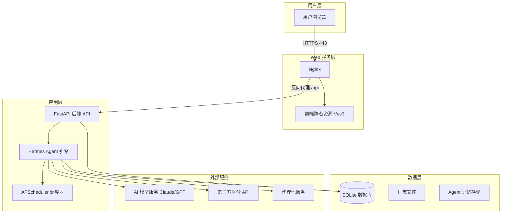
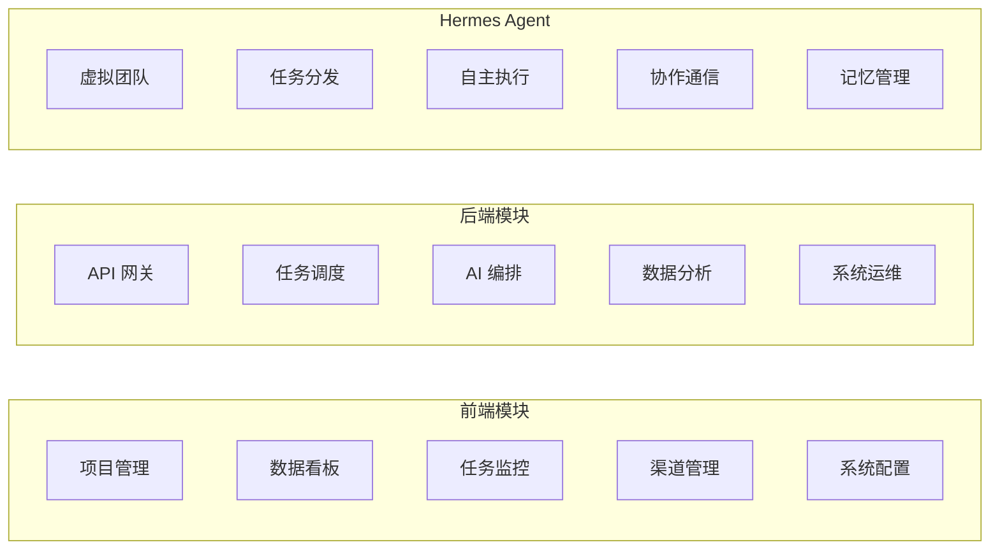
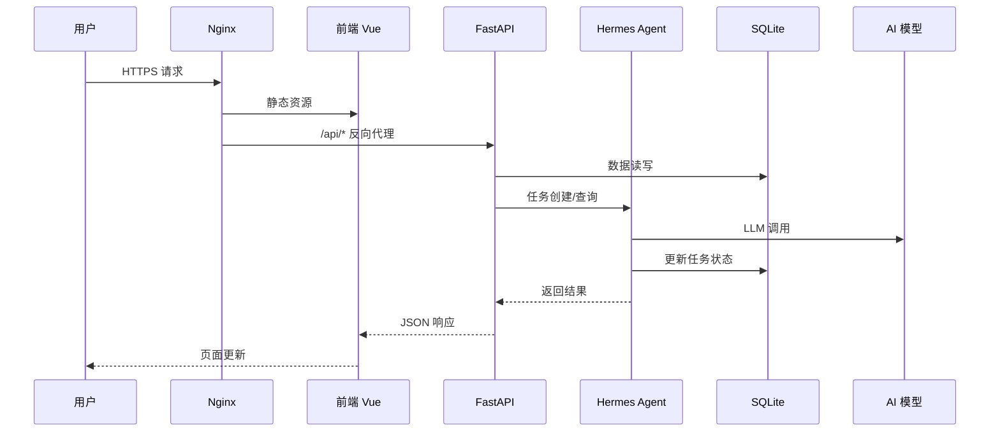
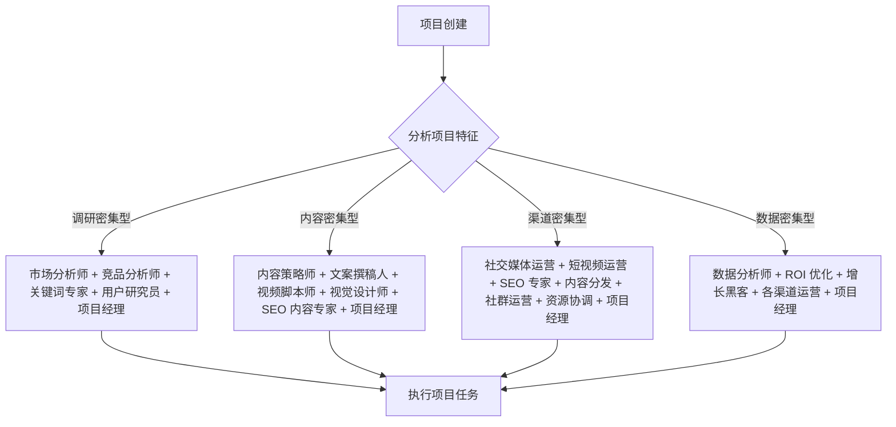

# Hermes 海外全自动免费营销系统 - 详细设计方案

**需求名称**: hermes-overseas-marketing  
**更新日期**: 2026-04-23  
**版本**: 1.0 (正式版)

---

## 一、概述

### 1.1 项目背景
Hermes 海外全自动免费营销系统是一个基于 AI Agent 的自动化营销平台，旨在帮助出海企业实现营销全流程的自动化。系统通过组建 AI 虚拟团队，自动完成市场调研、内容创作、多渠道分发、数据监控与优化复盘，实现从 0 到 1 的全托管式营销。

### 1.2 核心目标
- **全自动闭环**: 用户创建项目后，系统自动完成组队→调研→拆任务→执行→分发→复盘全流程
- **零人工干预**: 所有环节由 AI Agent 自主决策执行，用户仅需查看进度与结果
- **多渠道覆盖**: 支持主流海外内容平台与短剧 APP 的免费内容分发
- **数据驱动优化**: 实时监控曝光、点击、转化数据，基于 ROI 自动调整策略

### 1.3 技术选型总览

#### 前端技术栈
| 技术/框架 | 版本要求 | 用途 |
|-----------|----------|------|
| Vue | 3.4+ | 前端核心框架 |
| Vite | 5.x | 前端构建工具 |
| Element Plus | 2.x | UI 组件库 |
| ECharts | 5.x | 数据可视化图表库 |
| Axios | 1.x | HTTP 请求库 |
| Vue Router | 4.x | 路由管理 |
| Pinia | 2.x | 状态管理 |
| TypeScript | 5.x | 类型系统 |

#### 后端技术栈
| 技术/框架 | 版本要求 | 用途 |
|-----------|----------|------|
| Hermes Agent | 最新稳定版 | 核心 Agent 引擎、任务调度、AI 调用 |
| Python | 3.11+ | Hermes Agent 运行环境 |
| FastAPI | 0.115+ | 后端 API 服务（Hermes Agent 内置） |
| SQLite | 3.x | 轻量数据库 |
| Pydantic | 2.x | 数据模型校验 |
| APScheduler | 3.10+ | 定时任务调度 |
| SQLAlchemy | 2.x | ORM 框架 |
| Alembic | 1.x | 数据库迁移工具 |

#### 部署环境
| 组件 | 版本要求 | 用途 |
|------|----------|------|
| Nginx | 1.24+ | 静态资源托管、反向代理、HTTPS |
| PM2 | 5.x | 进程守护、开机自启 |
| Docker | 24+ | 容器化部署 |
| Docker Compose | 2.x | 容器编排、一键部署 |

---

## 二、系统架构

### 2.1 整体架构图



### 2.2 核心模块划分



### 2.3 请求处理流程



---

## 三、AI 角色体系设计（21 个固定角色）

### 3.1 角色分类

21 个 AI 角色分为五大类，覆盖营销全流程：

| 类别 | 角色数 | 职责说明 |
|------|-------|----------|
| 管理与策略 | 3 | 项目统筹、策略制定、资源协调 |
| 市场与调研 | 4 | 市场分析、竞对研究、用户洞察 |
| 内容与创意 | 6 | 文案撰写、视觉设计、视频脚本 |
| 渠道与分发 | 5 | 多平台发布、SEO 优化、代理管理 |
| 数据与分析 | 3 | 数据监控、效果分析、优化建议 |

### 3.2 角色选择策略

系统基于项目特征自动选择 5-7 个角色组成虚拟团队：



---

## 四、数据库设计（完整表结构）

### 4.1 项目表 (t_project)

```sql
CREATE TABLE t_project (
    id INTEGER PRIMARY KEY AUTOINCREMENT,
    name VARCHAR(255) NOT NULL,
    product VARCHAR(255) NOT NULL,
    target_market VARCHAR(50) NOT NULL,
    core_selling_point TEXT NOT NULL,
    target_keyword TEXT NOT NULL,
    target_channel TEXT NOT NULL,
    target_domain VARCHAR(255),
    affiliate_link VARCHAR(500),
    status VARCHAR(20) NOT NULL DEFAULT 'pending',
    progress INTEGER NOT NULL DEFAULT 0,
    total_task INTEGER NOT NULL DEFAULT 0,
    finish_task INTEGER NOT NULL DEFAULT 0,
    total_view INTEGER NOT NULL DEFAULT 0,
    total_click INTEGER NOT NULL DEFAULT 0,
    total_conversion INTEGER NOT NULL DEFAULT 0,
    total_commission DECIMAL(10,2) NOT NULL DEFAULT 0.00,
    create_time DATETIME NOT NULL DEFAULT CURRENT_TIMESTAMP,
    deadline DATETIME,
    research_report TEXT,
    remark TEXT
);
```

### 4.2 AI 角色表 (t_ai_role)

```sql
CREATE TABLE t_ai_role (
    id INTEGER PRIMARY KEY AUTOINCREMENT,
    role_code VARCHAR(50) NOT NULL UNIQUE,
    name VARCHAR(50) NOT NULL,
    avatar VARCHAR(500) NOT NULL,
    duty TEXT NOT NULL,
    default_prompt TEXT NOT NULL,
    custom_prompt TEXT,
    model_id INTEGER NOT NULL,
    status VARCHAR(20) NOT NULL DEFAULT 'idle',
    current_task VARCHAR(255),
    total_task INTEGER NOT NULL DEFAULT 0,
    finish_task INTEGER NOT NULL DEFAULT 0,
    success_rate DECIMAL(5,2) DEFAULT 0,
    create_time DATETIME NOT NULL DEFAULT CURRENT_TIMESTAMP,
    update_time DATETIME NOT NULL DEFAULT CURRENT_TIMESTAMP
);
```

### 4.3 任务表 (t_task)

```sql
CREATE TABLE t_task (
    id INTEGER PRIMARY KEY AUTOINCREMENT,
    project_id INTEGER NOT NULL,
    project_name VARCHAR(255) NOT NULL,
    role_id INTEGER NOT NULL,
    role_name VARCHAR(50) NOT NULL,
    task_name VARCHAR(255) NOT NULL,
    content TEXT NOT NULL,
    priority VARCHAR(20) NOT NULL DEFAULT 'medium',
    status VARCHAR(20) NOT NULL DEFAULT 'pending',
    progress INTEGER NOT NULL DEFAULT 0,
    result TEXT,
    retry_count INTEGER NOT NULL DEFAULT 0,
    max_retry INTEGER NOT NULL DEFAULT 2,
    pre_task_id INTEGER,
    dependency_type VARCHAR(50) DEFAULT 'finish_to_start',
    create_time DATETIME NOT NULL DEFAULT CURRENT_TIMESTAMP,
    deadline DATETIME NOT NULL,
    finish_time DATETIME,
    execute_log TEXT,
    FOREIGN KEY (project_id) REFERENCES t_project(id),
    FOREIGN KEY (role_id) REFERENCES t_ai_role(id),
    FOREIGN KEY (pre_task_id) REFERENCES t_task(id)
);
```

### 4.4 AI 模型表 (t_model)

```sql
CREATE TABLE t_model (
    id INTEGER PRIMARY KEY AUTOINCREMENT,
    model_code VARCHAR(50) NOT NULL UNIQUE,
    model_name VARCHAR(100) NOT NULL,
    provider VARCHAR(50) NOT NULL,
    api_key VARCHAR(500) NOT NULL,
    api_base_url VARCHAR(255),
    max_tokens INTEGER DEFAULT 4096,
    temperature DECIMAL(3,2) DEFAULT 0.7,
    status VARCHAR(20) NOT NULL DEFAULT 'active',
    daily_limit INTEGER,
    used_today INTEGER DEFAULT 0,
    reset_time TIME DEFAULT '00:00:00',
    create_time DATETIME NOT NULL DEFAULT CURRENT_TIMESTAMP,
    update_time DATETIME NOT NULL DEFAULT CURRENT_TIMESTAMP
);
```

### 4.5 API 配置表 (t_api_config)

```sql
CREATE TABLE t_api_config (
    id INTEGER PRIMARY KEY AUTOINCREMENT,
    platform VARCHAR(50) NOT NULL,
    api_name VARCHAR(100) NOT NULL,
    api_key VARCHAR(500),
    api_secret VARCHAR(500),
    access_token VARCHAR(500),
    refresh_token VARCHAR(500),
    token_expires DATETIME,
    config_json TEXT,
    status VARCHAR(20) NOT NULL DEFAULT 'active',
    last_used DATETIME,
    create_time DATETIME NOT NULL DEFAULT CURRENT_TIMESTAMP,
    update_time DATETIME NOT NULL DEFAULT CURRENT_TIMESTAMP,
    UNIQUE(platform, api_name)
);
```

### 4.6 代理池表 (t_proxy)

```sql
CREATE TABLE t_proxy (
    id INTEGER PRIMARY KEY AUTOINCREMENT,
    proxy_name VARCHAR(100) NOT NULL,
    proxy_type VARCHAR(20) NOT NULL DEFAULT 'http',
    ip_address VARCHAR(50) NOT NULL,
    port INTEGER NOT NULL,
    username VARCHAR(100),
    password VARCHAR(100),
    country VARCHAR(50),
    city VARCHAR(50),
    status VARCHAR(20) NOT NULL DEFAULT 'active',
    health_status VARCHAR(20) DEFAULT 'unknown',
    last_check DATETIME,
    response_time INTEGER,
    success_rate DECIMAL(5,2),
    total_requests INTEGER DEFAULT 0,
    failed_requests INTEGER DEFAULT 0,
    create_time DATETIME NOT NULL DEFAULT CURRENT_TIMESTAMP,
    update_time DATETIME NOT NULL DEFAULT CURRENT_TIMESTAMP
);
```

### 4.7 账号表 (t_account)

```sql
CREATE TABLE t_account (
    id INTEGER PRIMARY KEY AUTOINCREMENT,
    platform VARCHAR(50) NOT NULL,
    account_name VARCHAR(100) NOT NULL,
    account_email VARCHAR(255),
    username VARCHAR(100),
    encrypted_password VARCHAR(500),
    cookie_data TEXT,
    status VARCHAR(20) NOT NULL DEFAULT 'active',
    health_status VARCHAR(20) DEFAULT 'unknown',
    proxy_id INTEGER,
    last_login DATETIME,
    last_post DATETIME,
    daily_post_count INTEGER DEFAULT 0,
    total_post_count INTEGER DEFAULT 0,
    follower_count INTEGER DEFAULT 0,
    risk_level VARCHAR(20) DEFAULT 'low',
    create_time DATETIME NOT NULL DEFAULT CURRENT_TIMESTAMP
