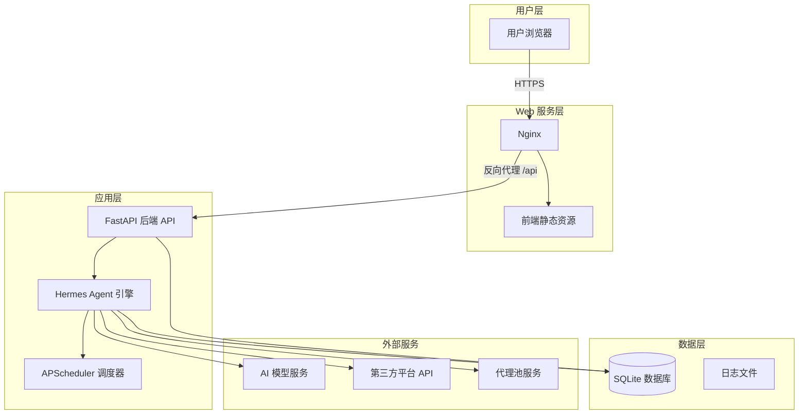
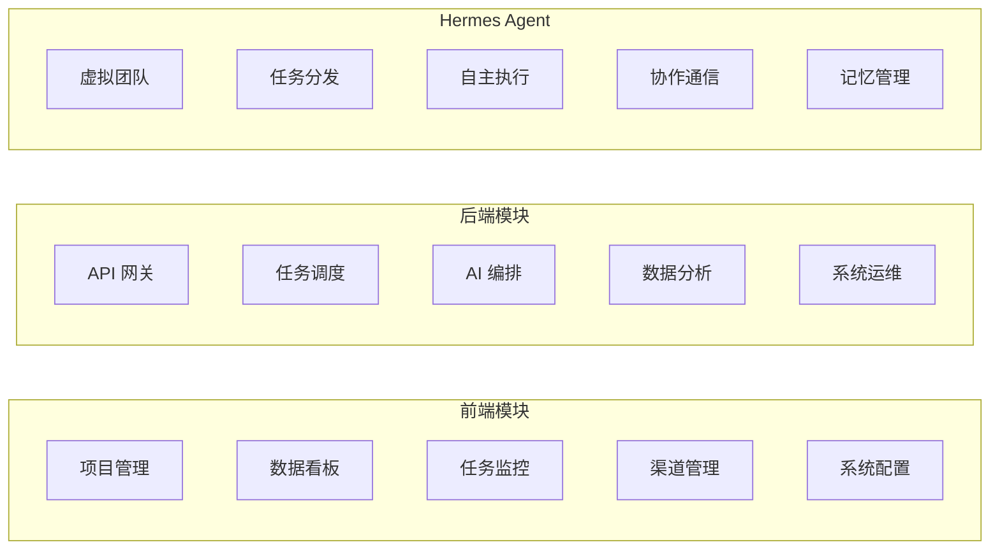

# Hermes 海外全自动免费营销系统 - 技术方案

**需求名称**: hermes-overseas-marketing  
**更新日期**: 2026-04-23  
**版本**: 0.1 (草案)

---

## 一、概述

### 1.1 项目背景
Hermes 海外全自动免费营销系统是一个基于 AI Agent 的自动化营销平台，旨在帮助出海企业实现营销全流程的自动化。系统通过组建 AI 虚拟团队，自动完成市场调研、内容创作、多渠道分发、数据监控与优化复盘，实现从 0 到 1 的全托管式营销。

### 1.2 核心目标
- **全自动闭环**: 用户创建项目后，系统自动完成组队→调研→拆任务→执行→分发→复盘全流程
- **零人工干预**: 所有环节由 AI Agent 自主决策执行，用户仅需查看进度与结果
- **多渠道覆盖**: 支持主流海外内容平台与短剧 APP 的免费内容分发
- **数据驱动优化**: 实时监控曝光、点击、转化数据，基于 ROI 自动调整策略

### 1.3 技术选型总览

#### 前端技术栈
| 技术/框架 | 版本要求 | 用途 |
|-----------|----------|------|
| Vue | 3.x | 前端核心框架 |
| Vite | 5.x | 前端构建工具 |
| Element Plus | 2.x | UI 组件库 |
| ECharts | 5.x | 数据可视化图表库 |
| Axios | 1.x | HTTP 请求库 |
| Vue Router | 4.x | 路由管理 |
| Pinia | 2.x | 状态管理 |

#### 后端技术栈
| 技术/框架 | 版本要求 | 用途 |
|-----------|----------|------|
| Hermes Agent | 最新稳定版 | 核心 Agent 引擎、任务调度、AI 调用 |
| Python | 3.11+ | Hermes Agent 运行环境 |
| FastAPI | 最新版 | 后端 API 服务（Hermes Agent 内置） |
| SQLite | 3.x | 轻量数据库 |
| Pydantic | 最新版 | 数据模型校验 |
| APScheduler | 最新版 | 定时任务调度 |

#### 部署环境
| 组件 | 版本要求 | 用途 |
|------|----------|------|
| Nginx | 1.24+ | 静态资源托管、反向代理、HTTPS |
| PM2 | 5.x | 进程守护、开机自启 |
| Docker | 24+ | 容器化部署 |
| Docker Compose | 2.x | 容器编排、一键部署 |

---

## 二、系统架构

### 2.1 整体架构图



### 2.2 核心模块划分



---

## 三、核心功能模块

### 3.1 项目管理模块
- **项目创建**: 用户输入产品/服务、目标市场、核心卖点、推广渠道等
- **自动组队**: 基于项目特征，从 21 个固定 AI 角色中选择 5-7 个组成虚拟团队
- **市场调研**: 竞对分析、关键词挖掘、爆款选题、受众画像
- **任务拆解**: 将调研结果转化为可执行的任务清单
- **进度追踪**: 实时显示项目整体进度、任务完成情况

### 3.2 AI 角色管理模块
- **角色库**: 内置 21 个固定角色（项目经理、市场分析师、SEO 专家等）
- **角色状态**: 实时显示每个角色的工作状态（空闲/执行中/异常）
- **任务分配**: 根据角色职责自动分配任务
- **绩效统计**: 记录每个角色的任务完成数、成功率

### 3.3 任务调度模块
- **任务队列**: 基于优先级的任务调度
- **依赖管理**: 支持前置任务依赖关系
- **重试机制**: 失败任务自动重试（最多 2 次）
- **超时控制**: 每个任务设置截止时间
- **日志记录**: 完整的任务执行日志

### 3.4 渠道管理模块
- **平台对接**: Facebook/TikTok/Instagram/YouTube 等主流平台
- **账号矩阵**: 支持多账号绑定、轮询发布
- **代理管理**: 代理池健康检查、自动切换
- **内容适配**: 根据不同平台格式要求自动调整内容

### 3.5 数据监控模块
- **数据看板**: 曝光量、点击量、转化率、佣金收入实时统计
- **趋势图表**: ECharts 可视化展示数据趋势
- **关键词排名**: 定时查询关键词排名并记录
- **异常告警**: 数据异常时触发告警通知

---

## 四、数据库设计（核心表）

### 4.1 项目表 (t_project)
```sql
CREATE TABLE t_project (
    id INTEGER PRIMARY KEY AUTOINCREMENT,
    name VARCHAR(255) NOT NULL,
    product VARCHAR(255) NOT NULL,
    target_market VARCHAR(50) NOT NULL,
    core_selling_point TEXT NOT NULL,
    target_keyword TEXT NOT NULL,
    target_channel TEXT NOT NULL,
    target_domain VARCHAR(255),
    affiliate_link VARCHAR(500),
    status VARCHAR(20) NOT NULL DEFAULT 'pending',
    progress INTEGER NOT NULL DEFAULT 0,
    total_task INTEGER NOT NULL DEFAULT 0,
    finish_task INTEGER NOT NULL DEFAULT 0,
    total_view INTEGER NOT NULL DEFAULT 0,
    total_click INTEGER NOT NULL DEFAULT 0,
    total_conversion INTEGER NOT NULL DEFAULT 0,
    total_commission DECIMAL(10,2) NOT NULL DEFAULT 0.00,
    create_time DATETIME NOT NULL DEFAULT CURRENT_TIMESTAMP,
    deadline DATETIME,
    research_report TEXT,
    remark TEXT
);
```

### 4.2 AI 角色表 (t_ai_role)
### 4.3 任务表 (t_task)
### 4.4 其他核心表
- t_model: AI 模型配置
- t_api_config: 第三方 API 配置
- t_proxy: 代理池管理
- t_account: 多账号矩阵
- t_keyword: 关键词监控
- t_content: 内容库
- t_system_log: 系统日志

---

## 五、部署架构

### 5.1 部署方式一：Shell 一键脚本
- `install.sh` 自动完成全量环境搭建
- 包含 Node.js/Python/Nginx/PM2 安装配置
- 自动配置 PM2 开机自启
- 输出访问地址与默认账号

### 5.2 部署方式二：Docker Compose
- `docker-compose.yml` 定义前端、后端、Nginx 三个服务
- 数据卷持久化挂载
- `restart: always` 自动重启策略
- 一键启动/停止/日志查看

### 5.3 服务器要求
| 配置项 | 最低要求 | 推荐配置 |
|--------|----------|----------|
| 系统 | Ubuntu 20.04 LTS | Ubuntu 22.04 LTS |
| CPU | 2 核 | 4 核 + |
| 内存 | 2GB | 4GB+ |
| 硬盘 | 20GB SSD | 40GB+ SSD |
| 带宽 | 5Mbps | 10Mbps+ |

---

## 六、验收标准

### 6.1 功能验收
- [ ] 所有 P0/P1 级功能 100% 实现
- [ ] 核心自动化闭环完整：创建项目后自动完成全流程
- [ ] 所有页面交互正常，无控制台报错
- [ ] 第三方 API 对接正常
- [ ] AI 角色正常执行任务，输出符合要求
- [ ] 关键词监控、代理管理正常

### 6.2 性能验收
- [ ] 前端首屏加载≤2s
- [ ] API 响应≤500ms
- [ ] 连续运行 72 小时无崩溃
- [ ] 同时运行 5 个项目、10 个并行任务稳定
- [ ] AI 内容生成成功率≥95%

### 6.3 部署验收
- [ ] Shell 脚本在全新 Ubuntu 22.04 正常执行
- [ ] Docker Compose 部署正常，数据持久化
- [ ] 服务器重启后服务自动恢复
- [ ] 部署文档清晰完整
- [ ] HTTPS 证书可正常配置

---

## 七、下一步工作

本草案文档已完成，需要您确认以下问题：

1. **技术栈确认**: 前端 Vue3 + Vite + Element Plus，后端 Hermes Agent + FastAPI + SQLite，是否符合您的预期？
2. **部署方式**: 同时提供 Shell 脚本和 Docker Compose 两种部署方式，是否满足需求？
3. **核心功能**: 项目管理、AI 角色、任务调度、渠道管理、数据监控五大模块划分是否合理？
4. **数据库设计**: 核心表结构是否符合业务需求？是否需要调整？
5. **AI 角色 Prompt**: 是否需要进一步细化 21 个角色的专属 Prompt 模板？

**请确认上述方向是否正确**，如果有需要补充或调整的地方，请告诉我。确认无误后，我将开始完善详细的技术设计方案。
